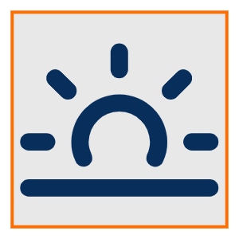
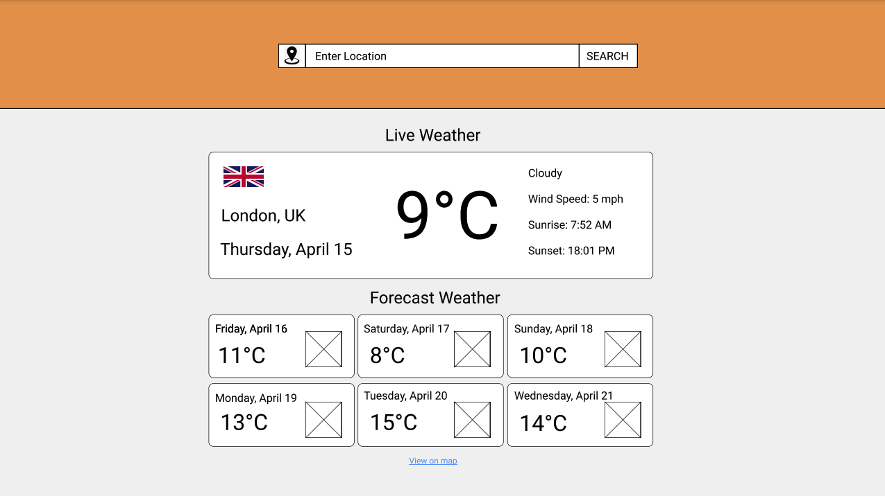
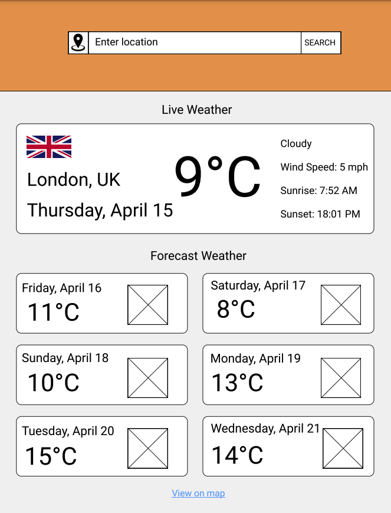
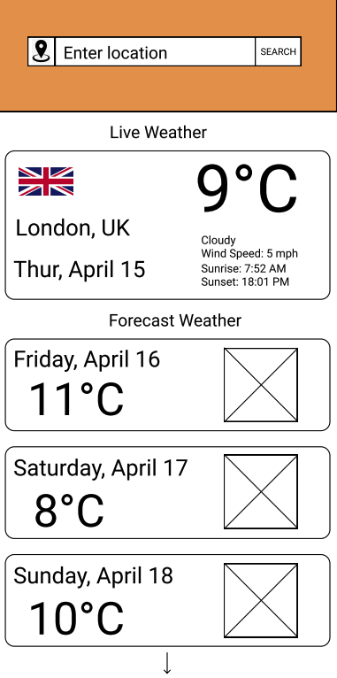

# Milestone Project 2 - Weather Now

---

## Table of Contents:

- [What is Weather Now?](#what-does-it-do-and-what-does-it-need-to-fulfill)
- [User Experience](#user-experience)
  - [User Stories](#user-stories)
  - [Design](#design)
    - [Objective](#objective)
    - [Font](#font)
    - [Colour Scheme](#colour-scheme)
    - [Logo](#logo)
    - [Wireframes](#wireframes)
- [Technologies Used](#technologies-used)
  - [Languages](#languages)
  - [Tools Used](#tools-used)
- [Features](#features)
  - [Current Features](#current-features)
  - [Future Features](#future-features)
- [Testing](#testing)
- [Deployment](#deployment)
- [External Resources](#external-resources)
- [Credits](#credits)
- [Acknowledgements](#acknowledgements)

---

<h1 style="text-align: center;">Weather Now</h1>

---

## What is Weather Now?

Weather Now - Milestone Project #2 - is a Front-end Web Application that provides Users with live weather data and forecast data. For Milestone Project #2, it helps demonstrate updating DOM elements with JSON from a REST API. It also provides another chance to solidify and practice more CSS and Design Skills.

[Back to top](#table-of-contents)

## User Experience:

#### User Stories:

- _As a User_, I want to be able to input my own custom location into an input field in order to get weather data from my desired location.
   
- _As a User_, I want to be able to successfully submit my input in order to retrieve weather data for my input.
   
- _As a User_, I want some sort of feedback to let me know my search request has went through.
   
- _As a User_, I want to be able to use my device's location in order to get weather data without needing to type in my location.
   
- _As a User_, I want to be able to view the results of my successful search in order to get an idea of the current weather.
   
- _As a User_, I want to view the next few days of weather data for my searched location so that I can gain an idea of what the weather will be like in the future.
   
- _As a User_, I want to be able to click a hyperlink that will redirect me to a google maps view of my location so I can better plan a trip or excursion.

#### Design

##### Objective

The main objective was to make an intuitive UX, the user should not be confused when visiting the Website. To achieve this, the approach was to use a simple, succinct, one-page web application. The User immediately sees an text-input that tells them to enter a location through a placeholder.

If the User is on Mobile, the UX objective was to limit the amount of User Actions to perform a search. This was achieved by using a 'Current Location' button, so they can get search results within one click.

The results of the search needed to be clear while also not bombarding the User with information. The REST API that collected Weather Data had a lot of data that could be displayed, so there was a process of elimination to decide what information is most important to the user - i.e what causes them to make a search, what do they want?

##### Font

The chosen font for the application was [Poppins](https://fonts.google.com/specimen/Poppins?preview.text_type=custom). It is a clear and legible font that is very mobile friendly.

If the Browser the User uses doesn't support this font or Google Fonts is down, the back-up font is 'sans-serif' which should be built into all modern Operating Systems.

##### Colour Scheme

-  `#082F5C` - Primary colour
-  `#0A5ED7` - Secondary colour
-  `#E8E8E8` - Tertiary colour
-  `#E69F6A` - Supplementary colour
-  `#FF6D00` - Supplementary colour 2

The colours were chosen to convey a clean and friendly design with colours that complemented eachother. The Input Container uses the `primary`  colour while the buttons within that Input Container use the `secondary`  `#0A5ED7` colour to provide some contrast between the two.

In order to prevent the whole application having a blue-theme in `primary`  & `secondary`  `#0A5ED7` - the toggle switch uses the supplementary colours -  &  in order to provide more contrast and distinguish it from its background.

The background for the body of content uses `tertiary`  as the content of the weather containers are `white` - it also provides some contrast to distinguish the two.

##### 3. Logo

The logo was created on [logomakr](https://logomakr.com/). It provides a free, low resolution access to many image assets. The logo is consistent with the colour theme, it uses `primary`, `tertiary` and `supplementary colour 2`.

    

##### Wireframes

Wireframes were created using [Figma](https://www.figma.com/) and can be viewed [here](https://drive.google.com/file/d/1s7Hv7wWzHhgLbM9jab1OBNAycsc-QOtJ/view?usp=sharing).

As per the UX Objective, the goal was to create a simple and intuitive User Interface, initially, the colour schemes were different but as development went on, it was realized it needed more contrasting themes in order to engage the User.

The Wireframes were created at 3 target resolutions:

- Desktop - 1920px x 1080px

- Tablet - 768px x 1024px

- Mobile - 360px x 720px

[Back to Top](#table-of-contents)

---

## Technologies Used

#### Languages

- HTML5
- CSS3 & Bootstrap 5
- JavaScript

#### Tools Used

- APIs - [OpenWeatherMap](https://openweathermap.org/api), [Geolocation](https://developer.mozilla.org/en-US/docs/Web/API/Geolocation_API) and [Country Flags](https://www.countryflags.io/).
- Weather Icon Pack - [RNS Weather Icons](https://iconstore.co/icons/rns-weather-icons/).
- Developed in Google Chrome and Dev Tools used to debug & test.
- Git / Github for Version Control and Issue Management.
- [Stack Overflow](https://stackoverflow.com/) for CSS toggler.
- [Netlify](https://www.netlify.com/) for Deployment

## Features

#### Future Features:

## Testing

#### Found Bugs & Fixes:

## Deployment

[Back to Top](#table-of-contents)

## Credits

[Back to Top](#table-of-contents)

#### Acknowledgements:

[Back to Top](#table-of-contents)
