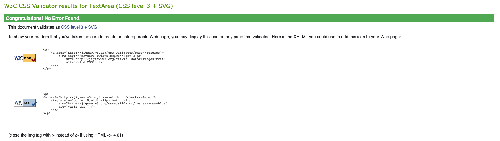

# Testing

---

## Table of Contents:

- [Code Validation](#code-validation)
  - [W3C HTML Validator](#w3c-html-validator)
  - [W3C CSS Jigsaw Validator](#w3c-css-jigsaw-validator)
- [Performance](#performance)
  - [PageSpeed Insights](#pagespeed-insights)
  - [Google Lighthouse](https://github.com/kenwilde1/crate-o-wine/blob/main/TESTING.md#google-lighthouse)
- [User Testing](#user-testing)
  - [Browser Compatibility](#browser-compatibility)
  - [User Stories Testing](#user-stories-testing)
  - [User Inputs Testing](#user-inputs)
- [Bugs](#bugs)

## Code Validation

### W3C HTML Validator

All html written for the site was checked using the HTML Validator on [W3C](https://validator.w3.org/).

- #### index.html


The HTML was checked using the W3C validator, it recommended aria-labels on the empty `<a>` and `<button>` elements that contained font awesome icons, once that was added, it passed with no errors or warnings.

### W3C CSS Jigsaw Validator

The Custom CSS `style.css` was validated using [Jigsaw](https://jigsaw.w3.org/css-validator/validator) and had no errors or warnings:



---

## Performance

### PageSpeed Insights

I ran the deployed site through Google's PageSpeed Insights to understand the speed of the site and if there could be any adjustments to make it faster. The site scored 99% on pagespeed, the insight did not make any recommendations to make it faster.


### Google Lighthouse

Google Lighthouse was used to test many factors of the website, mainly - Performance, Accessibility, Best Practices and Search Engine Optimisation.

Upon running the the first time, it scored 89% on Search Engine Optimization. Digging deeper, it provided the following recommendation:

<br />

The anchor tags that redirected to a new site should implement the following attributes:

- `rel="noopener"` - instructs the browser to navigate to the href without granting the new site access to the document that opened it - improves security.
- `rel="noreferrer"` - prevents the target site from accessing the origin site's information - good for security and prevents tracking for Google Analytics.

Once those changes were implemented, I ran Google Lighthouse again and scored:

<br />

[Back to top](#table-of-contents)

---

## User Testing

### Browser Compatibility

The above HTML and CSS Validators will test for valid code that can run on all browsers.

The following functions were tested on the following browsers using a pass / fail system:

**Note**: Responsiveness covers Desktop, Mobile and Tablet.

| Function                   |              Browser              | Result |
| -------------------------- | :-------------------------------: | -----: |
| Input Resposivness         | Chrome / Firefox / Safari / Opera |   Pass |
| Live Weather Responsivness | Chrome / Firefox / Safari / Opera |   Pass |
| Forecast Responsiveness    | Chrome / Firefox / Safari / Opera |   Pass |
| Footer Responsivness       | Chrome / Firefox / Safari / Opera |   Pass |
| Geolocation API            | Chrome / Firefox / Safari / Opera |   Pass |
| Search Weather             | Chrome / Firefox / Safari / Opera |   Pass |
| Toggle Metric Switch       | Chrome / Firefox / Safari / Opera |   Pass |
| Display Live Weather       | Chrome / Firefox / Safari / Opera |   Pass |
| Display Forecast Weather   | Chrome / Firefox / Safari / Opera |   Pass |
| Import Images              | Chrome / Firefox / Safari / Opera |   Pass |
| View Map Hyperlink         | Chrome / Firefox / Safari / Opera |   Pass |
| Footer Links               | Chrome / Firefox / Safari / Opera |   Pass |

[Back to top](#table-of-contents)

### User Stories Testing

This section will go through each User Story created and see if the objective has succeeded.

- _As a User_, I want to be able to input my own custom location into an input field in order to get weather data from my desired location.
  - User can enter custom location into Input
  - Input is responsive on all devices
    <br>
- _As a User_, I want to be able to successfully submit my input in order to retrieve weather data for my input.
  - Once User has entered in location input and clicks search, the application will successfully return weather results.
  - If the User enters a non-existent or invalid location, the application will return an alert and they can try again.
    <br>
- _As a User_, I want some sort of feedback to let me know my search request has went through.
  - Once the User submits the search, a spinner loader will appear, giving the user some sort of feedback that the app is reading their request.
    <br>
- _As a User_, I want to be able to use my device's location in order to get weather data without needing to type in my location.
  - User can click the custom location icon to grab weather data for their device's location.
  - If the User's browser does not support the Geolocation API or they have blocked permissions, the app will alert the user of this so they can make changes to enable it or change browsers.
    <br>
- _As a User_, I want to be able to view the results of my successful search in order to get an idea of the current weather.
  - Once a search goes through, the live weather container will be displayed.
    <br>
- _As a User_, I want to view the next few days of weather data for my searched location so that I can gain an idea of what the weather will be like in the future.
  - Once a search goes through, the forecast container will be displayed, it will show the next 6 days of weather data (starting tomorrow).
    <br>
- _As a User_, I want to be able to click a hyperlink that will redirect me to a google maps view of my location so I can better plan a trip or excursion.
  - The hyperlink will appear below forecast data, it will then bring them into a new tab so they can return to the site after visiting Google Maps.

[Back to top](#table-of-contents)

### User Inputs

With the use of an input element, a lot of User Testing is required. The input needed to be sanitized before reaching the API request. If the request was unsuccessful due to the input, the web application needed to relay that to the user and try again. The following steps were taken to test and handle User Inputs:

- Ensure all input strings were lowercase. The API was case sensitive. If a User entered in 'Dublin', it would fail, whereas 'dublin' would succeed. The following code ensured it was lowercase before reaching the API:

```
const formattedCity = city.toString().toLowerCase();
```

- There was some unexpected behaviour when the User entered in numbers. For example, '12345' would retrieve results and return weather data from a place in Ukraine. On further investigation, the API actually accepted City IDs as a param. As this was unwanted behaviour, I implemented RegEx testing to ensure any entered input were characters and not numbers:

```
if (/\d/.test(formattedCity)) {
    alert(`'${formattedCity}' is not a valid location, try again`);
    return;
  }
```

- If the API request failed, it was required to inform the User and stop the request loop. In order to handle any requests that failed, I implemented the following to inform the User that the input they searched for was not valid:

```
if (!response.ok) {
      alert(`'${city}' is an invalid location, try again`);
      return;
    }
```

This ensured that any HTTP code that was not HTTP 200, would return the user with some feedback.

- If the above methods did not catch any errors, I also wrapped the fetch function in a try, catch. If the code returned any errors that weren't already handled, it would catch and alert the User.

```
try {
  // fetch weather data
} catch(err) {
  alert(err)
}
```

[Back to top](#table-of-contents)

### Bugs

- Geolocation API disabled - If the User rejected the permissions request by the Browser to enabled Geolocation, the app would load indefinitely along with a console error.
  - In order to solve this, I created a reject function that was triggered if a promise was rejected, the promise waited for permissions, if the permission was denied, it would trigger the rejected function. This function alerts the User they need to enable the API and returns the function to stop the loop spinning indefinitely.
    <br />
- Selecting Fahrenheit before searching - If the user selects fahrenheit before searching, it would return the results in celsius. This is because the toggle switch only handled converting temps that were already in display.

  - To fix this, I created a getMetric function. Before retrieving weather data, this function was called to see if the metric was set to imperial or metric - (fahrenheit or celsius) - based on this value, it would pass it onto the fetch call so the results would come back in either celsius or fahrenheit.
    <br />

- Inputting Numbers to Input Element - If the User inputted numbers to the input, certain numbers would actually yield a successful result. This was due to the API accepting City IDs as valid params.
  - As this was an unintended feature, the input needed to be sanitized with a regex test to ensure the input did not contain any numbers, if it did - then alert the user that it is not valid and to try again.
<br />
- On Safari, flexbox `gap` is not supported which led to the following undesired effect on the footer items:


  As a workaround, I decided to add some margin to the middle-icon, so that it would also look fine for browsers that did support flexbox gap:

  ```
  #linkedin-footer-item {
  margin-left: 5px;
  margin-right: 5px;
  }
  ```
  <br />
  

<br />

Click here to go back to [README.md](https://github.com/kenwilde1/crate-o-wine/blob/main/TESTING.md#testing)
